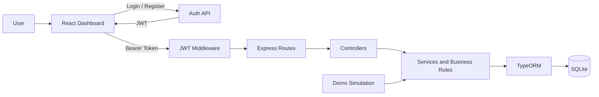

<div align="center">

# MakineTakip

### Secure, real-time machine monitoring for a mini MES environment

Monitor machine states, availability, downtime and live sensor data from one responsive dashboard.

[](https://www.typescriptlang.org/)
[](https://nodejs.org/)
[](https://react.dev/)
[](https://www.sqlite.org/)
[](#testing)
[](#authentication-and-security)

**Internship case study · Cormind · Mini Manufacturing Execution System**

</div>

---

## Overview

MakineTakip is a full-stack mini Manufacturing Execution System (MES) application developed for monitoring machines in a factory environment.

It records machine status transitions and sensor readings, calculates availability and tracked production durations, generates live demo data, and protects operational endpoints with JWT-based authentication.

|        Live Monitoring        |        Production Insights        |      Secure Access      |
| :---------------------------: | :-------------------------------: | :---------------------: |
|  Status-aware machine cards   | Availability and duration details |  Register and sign in   |
| Auto-refreshing sensor charts |   Running and downtime tracking   | bcrypt password hashing |
|  Status transition timeline   |  Temperature, pressure and speed  | Protected JWT endpoints |

## Highlights

- **Real-time dashboard** with status-aware cards and automatic refresh
- **Availability analytics** with running, down and tracked durations
- **Live demo simulation** that generates realistic status and sensor activity
- **Interactive charts** for temperature, pressure and machine speed
- **Status timeline** showing transitions, reasons and durations
- **Secure authentication** with bcrypt, JWT and protected API routes
- **22 automated tests** for availability, status rules and authentication

## System Architecture



The backend uses a layered architecture:

| Layer       | Responsibility                               |
| ----------- | -------------------------------------------- |
| Routes      | Define API paths and HTTP methods            |
| Controllers | Validate requests and return HTTP responses  |
| Services    | Apply business rules and database operations |
| Entities    | Define tables and relationships              |
| Middleware  | Verify JWT access tokens                     |
| Utils       | Provide reusable pure calculation logic      |

## Core Features

### Machine Monitoring

- Create and list machines directly from the dashboard
- View current machine status with dynamic colors and card accents
- Change status manually between `RUNNING`, `DOWN`, `SETUP` and `IDLE`
- View the last transition and relative transition time
- Open a complete chronological status timeline
- Display downtime reasons when a machine is `DOWN`

### Availability and Sensor Analytics

- Calculate availability for a selected time range
- Display running, down and total tracked durations
- Record temperature, pressure and speed readings
- Filter sensor readings using `from` and `to` dates
- Display current sensor values and the latest 30 readings
- Refresh Recharts line charts automatically every 5 seconds

### Live Demo Simulation

- Start and stop the simulation from the dashboard
- Display how long the demo has been running
- Generate sensor readings automatically every 5 seconds
- Change a random machine status every 20 seconds
- Prevent consecutive identical statuses
- Add `Automatic demo downtime` when the generated status is `DOWN`
- Process generated events through the existing service layer and business rules

### Authentication and Security

- Register, sign in and sign out from the frontend
- Hash passwords with bcrypt before database storage
- Return a signed JWT after successful authentication
- Protect machine and simulation endpoints with `requireAuth`
- Attach the token automatically to frontend API requests
- Clear invalid or expired sessions
- Store the JWT signing secret in an ignored `.env` file

## Business Rules

> Business rules are enforced in the service layer so manual API calls, frontend actions and demo simulation events follow the same behavior.

1. A machine can have only one active status.
2. The previous status is closed before the next one starts.
3. Consecutive identical statuses are rejected.
4. A reason is mandatory when a machine enters `DOWN`.
5. Status timestamps must remain chronologically consistent.
6. Status transitions run inside a database transaction.
7. Creating a machine also creates its initial status.

## Availability Calculation

```text
Availability (%) = Running Time / (Running Time + Down Time) x 100
```

The pure calculation function handles:

- Empty status histories
- Open status records
- Records outside the requested range
- Partially overlapping records
- Invalid ranges and timestamps
- `SETUP` and `IDLE` records

The API response also includes `runningDuration`, `downDuration` and `totalTrackedDuration`.

## Technology Stack

| Area           | Technologies                          |
| -------------- | ------------------------------------- |
| Backend        | Node.js, TypeScript, Express          |
| Database       | SQLite, better-sqlite3, TypeORM       |
| Authentication | bcryptjs, JSON Web Token              |
| Frontend       | React, TypeScript, Vite, Tailwind CSS |
| Visualization  | Recharts                              |
| Quality        | Vitest, ESLint, Prettier              |
| Development    | Concurrently, Git                     |

## Quick Start

### 1. Clone the repository

```bash
git clone https://github.com/Zeynepdmrdn/Makine-takip.git
cd Makine-takip
```

### 2. Install dependencies

```bash
npm install
npm --prefix frontend install
```

### 3. Create the environment file

macOS or Linux:

```bash
cp .env.example .env
```

Windows PowerShell:

```powershell
Copy-Item .env.example .env
```

Generate a secure local JWT secret:

```bash
node -e "console.log(require('crypto').randomBytes(48).toString('hex'))"
```

Place the generated value in `.env`:

```env
JWT_SECRET=your-generated-secret
```

> Never commit `.env`. Only `.env.example` should be stored in Git.

### 4. Run the application

```bash
npm run dev
```

For PowerShell environments that block `npm.ps1`:

```powershell
npm.cmd run dev
```

| Application  | Address                        |
| ------------ | ------------------------------ |
| Frontend     | `http://localhost:5173`        |
| Backend      | `http://localhost:3000`        |
| Health check | `http://localhost:3000/health` |

Vite may select `5174` or `5175` if the default frontend port is occupied.

## First Login

1. Open the frontend address shown in the terminal.
2. Select **Register**.
3. Enter a name, email and a password containing at least 8 characters.
4. Registration creates the user, hashes the password and starts a JWT session.
5. Select **Sign Out** to clear the session.

## API Reference

Public routes do not require a token. Protected routes require:

```http
Authorization: Bearer your-jwt-token
```

| Method | Endpoint                               | Access    | Purpose                           |
| ------ | -------------------------------------- | --------- | --------------------------------- |
| GET    | `/health`                              | Public    | Backend health check              |
| POST   | `/auth/register`                       | Public    | Register and receive a JWT        |
| POST   | `/auth/login`                          | Public    | Sign in and receive a JWT         |
| GET    | `/machines`                            | Protected | List machines and statuses        |
| POST   | `/machines`                            | Protected | Create a machine                  |
| GET    | `/machines/:id`                        | Protected | Get one machine with related data |
| POST   | `/machines/:id/status`                 | Protected | Change machine status             |
| POST   | `/machines/:id/readings`               | Protected | Add a sensor reading              |
| GET    | `/machines/:id/readings`               | Protected | List sensor readings              |
| GET    | `/machines/:id/readings?from=&to=`     | Protected | Filter readings by date           |
| GET    | `/machines/:id/availability?from=&to=` | Protected | Get availability details          |
| GET    | `/simulation/status`                   | Protected | Get simulation state              |
| POST   | `/simulation/start`                    | Protected | Start live demo generation        |
| POST   | `/simulation/stop`                     | Protected | Stop live demo generation         |

<details>
<summary><strong>Example authentication requests</strong></summary>

### Register

```http
POST /auth/register
Content-Type: application/json
```

```json
{
  "name": "Demo User",
  "email": "demo@example.com",
  "password": "Password123"
}
```

### Login

```http
POST /auth/login
Content-Type: application/json
```

```json
{
  "email": "demo@example.com",
  "password": "Password123"
}
```

</details>

<details>
<summary><strong>Example machine requests</strong></summary>

### Create a machine

```json
{
  "name": "Cutting Machine",
  "code": "MC-001"
}
```

### Change status

```json
{
  "status": "DOWN",
  "reason": "Maintenance required"
}
```

### Add a sensor reading

```json
{
  "temperature": 74.5,
  "pressure": 5.4,
  "speed": 1250
}
```

</details>

## Testing

```bash
npm test
```

| Test group               |  Count | Coverage                                               |
| ------------------------ | -----: | ------------------------------------------------------ |
| Availability calculation |     10 | Ranges, overlaps, open events and invalid input        |
| Machine status service   |      6 | Transition rules, reasons and transactions             |
| Authentication service   |      6 | Hashing, normalization, duplicate users, login and JWT |
| **Total**                | **22** | **All passing**                                        |

Run the complete quality checks:

```bash
npm run type-check
npm run lint
npm test
npm run build
npm --prefix frontend run lint
npm --prefix frontend run build
```

## Available Commands

| Command                | Description                         |
| ---------------------- | ----------------------------------- |
| `npm run dev`          | Start backend and frontend together |
| `npm run dev:backend`  | Start only the backend              |
| `npm run dev:frontend` | Start only the frontend             |
| `npm run build`        | Build the backend without tests     |
| `npm start`            | Run the compiled backend            |
| `npm run seed`         | Insert sample development data      |
| `npm run type-check`   | Check TypeScript types              |
| `npm run lint`         | Run backend ESLint checks           |
| `npm run format`       | Format files with Prettier          |
| `npm run format-check` | Check Prettier formatting           |
| `npm test`             | Run all tests once                  |
| `npm run test:watch`   | Run tests in watch mode             |

## Project Structure

<details>
<summary><strong>View directory layout</strong></summary>

```text
makine-takip/
|-- frontend/
|   `-- src/
|       |-- components/
|       |-- config/
|       |-- types/
|       `-- App.tsx
|-- src/
|   |-- config/
|   |-- controllers/
|   |-- database/
|   |-- entities/
|   |-- errors/
|   |-- middleware/
|   |-- routes/
|   |-- scripts/
|   |-- services/
|   |-- utils/
|   `-- app.ts
|-- .env.example
|-- package.json
|-- tsconfig.json
`-- tsconfig.build.json
```

</details>

## Technical Decisions

- **SQLite** keeps the internship case lightweight and locally reproducible.
- **TypeORM** provides typed entities, relations and repository operations.
- **Services** centralize business rules for API, frontend and simulation actions.
- **Transactions** keep status closing and creation atomic.
- **Pure functions** make availability calculations independently testable.
- **bcryptjs** prevents plain-text password storage.
- **JWT middleware** protects operational endpoints.
- **React + Tailwind CSS** provide a responsive component-based interface.
- **Recharts** displays live sensor history.
- **Vitest** verifies calculation and service-level behavior.

## Security Notes

> This repository contains `.env.example`, never the real `.env` file.

- Use a long random `JWT_SECRET` for every environment.
- Use HTTPS for deployed authentication and API traffic.
- Do not deploy local SQLite data as production data.
- Review dependency audit results before deployment.

## Known Limitations

- SQLite and `synchronize: true` are intended for local development and demonstration.
- Database migrations are not included.
- Role-based authorization is not implemented.
- Refresh tokens, password reset and account recovery are not implemented.
- Pagination is not implemented for machine, status or sensor lists.
- Frontend component and end-to-end tests are not included.
- Recharts currently causes a production bundle size warning.
- The application is not deployed to a production environment.

---

<div align="center">

Built as a full-stack MES internship case study.

**MakineTakip · TypeScript · React · Express · SQLite**

</div>
