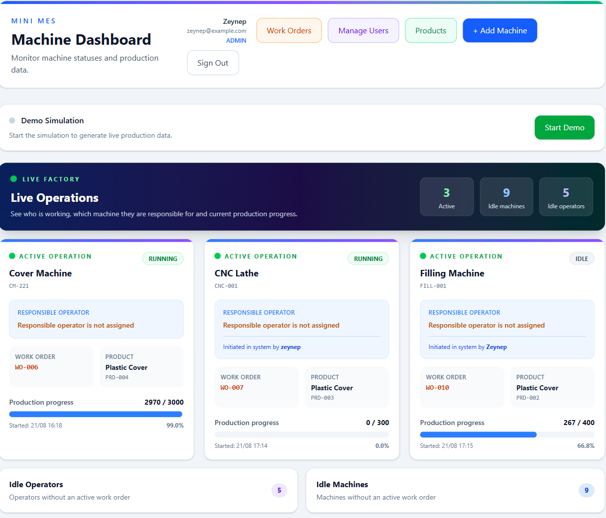
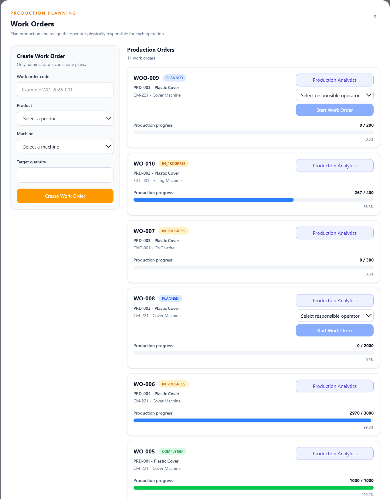
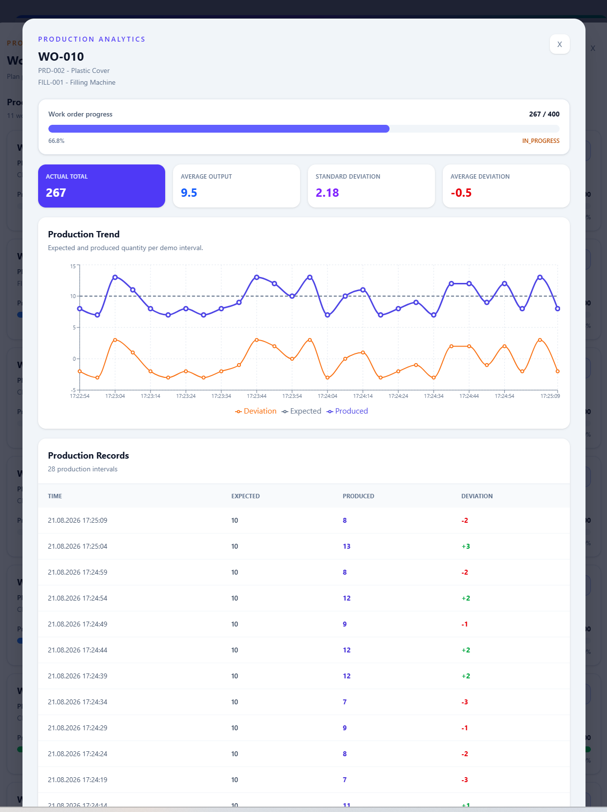
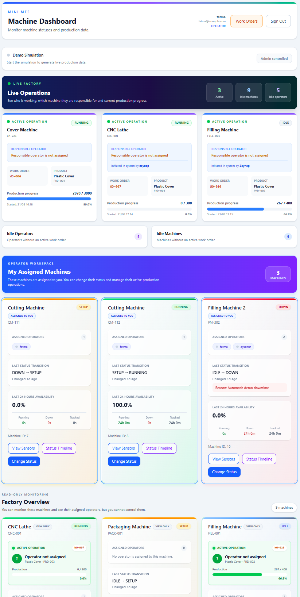

# MakineTakip

MakineTakip is a small Manufacturing Execution System (MES) project that I developed during my internship. The project started with basic machine and sensor tracking. I later added production planning, user roles, operator assignments and live operation monitoring.

The main purpose is to see the current situation in the factory from a single screen: which machines are running, which work orders are active, who is responsible for them and how production is progressing.



## Features

- Machine status tracking: `RUNNING`, `DOWN`, `SETUP` and `IDLE`
- Machine status history and availability calculation
- Temperature, pressure and speed readings
- Product and work order management
- Production progress and production record analysis
- Responsible operator selection for active work orders
- Live view of active operations, idle operators and idle machines
- Machine assignment and access control for operators
- Target completion notifications
- Demo simulation that generates status, sensor and production data
- JWT authentication and role-based authorization

## User roles

| Role | Permissions |
| --- | --- |
| `ADMIN` | Manages machines, products, work orders, users and operator assignments. Can start the demo. |
| `OPERATOR` | Manages assigned machines and can work on authorized production operations. |
| `VIEWER` | Can view machines, work orders and production information without making changes. |

Newly registered users start with the `VIEWER` role. An administrator can change their role and assign machines to operators.

## Main workflow

1. The administrator creates products and machines.
2. Machines are assigned to operators from the user management screen.
3. A work order is created for a product and a machine.
4. An authorized operator is selected when the work order is started.
5. Production records update the progress and can be examined from the analytics screen.

## Screenshots

### Work orders

Work orders can be planned, started and completed. The responsible operator is selected before starting an order.



### Production analytics

Expected quantity, produced quantity and deviation can be followed for each production interval.



### Operator screen

Operators see their assigned machines first. Other machines are still visible, but they are read-only.



## Technologies

| Part | Technologies |
| --- | --- |
| Backend | Node.js, TypeScript, Express |
| Database | SQLite, TypeORM, better-sqlite3 |
| Frontend | React, TypeScript, Vite, Tailwind CSS |
| Charts | Recharts |
| Authentication | JWT, bcryptjs |
| Tests and code quality | Vitest, ESLint, Prettier |
| Container | Docker, Docker Compose, Nginx |

## Running with Docker

Docker is the easiest way to run the whole project.

### 1. Clone the repository

```bash
git clone https://github.com/Zeynepdmrdn/Makine-takip.git
cd Makine-takip
```

### 2. Create the environment file

Windows PowerShell:

```powershell
Copy-Item .env.example .env
```

macOS or Linux:

```bash
cp .env.example .env
```

Open `.env` and replace the example values. Do not commit this file.

```env
JWT_SECRET=replace-with-a-long-random-secret
SEED_ADMIN_NAME=Administrator
SEED_ADMIN_EMAIL=admin@example.com
SEED_ADMIN_PASSWORD=replace-with-a-strong-password
```

### 3. Build and start

```bash
docker compose up --build -d
```

### 4. Add the initial demo data

```bash
docker compose exec backend node dist/scripts/seed.js
```

The application will be available at:

- Frontend: `http://localhost:8080`
- Backend health check: `http://localhost:8080/api/health`

To stop the containers:

```bash
docker compose down
```

The SQLite database is stored in a Docker volume, so normal container restarts do not delete the data. Running `docker compose down -v` also deletes this volume and should only be used when a clean database is wanted.

## Running locally

Node.js is required for local development.

```bash
npm install
npm --prefix frontend install
```

Create `.env` from `.env.example`, then start the backend and frontend together:

```bash
npm run dev
```

On Windows, if PowerShell blocks `npm.ps1`, use:

```powershell
npm.cmd run dev
```

Local addresses:

- Frontend: `http://localhost:5173`
- Backend: `http://localhost:3000`
- Health check: `http://localhost:3000/health`

## Tests and checks

The backend currently has 49 automated tests covering authentication, products, work orders, production records, machine status rules and availability calculations.

```bash
npm run type-check
npm run lint
npm test
npm run build
npm --prefix frontend run lint
npm --prefix frontend run build
```

## Project structure

```text
makine-takip/
├── frontend/             # React application
│   └── src/
│       ├── components/
│       ├── hooks/
│       ├── config/
│       └── types/
├── src/                  # Express application
│   ├── controllers/
│   ├── database/
│   ├── entities/
│   ├── middleware/
│   ├── routes/
│   ├── scripts/
│   ├── services/
│   └── utils/
├── compose.yaml
├── Dockerfile
└── README.md
```

## Notes

This is an internship project, not a production MES product. SQLite and TypeORM synchronization kept the setup simple while I was developing the project. For a real factory deployment, database migrations, password recovery, HTTPS, logging and more detailed end-to-end tests would be needed.

During this project I mainly practiced building a full-stack application, separating business rules into services, working with relational data, implementing authorization and running the application with Docker.
